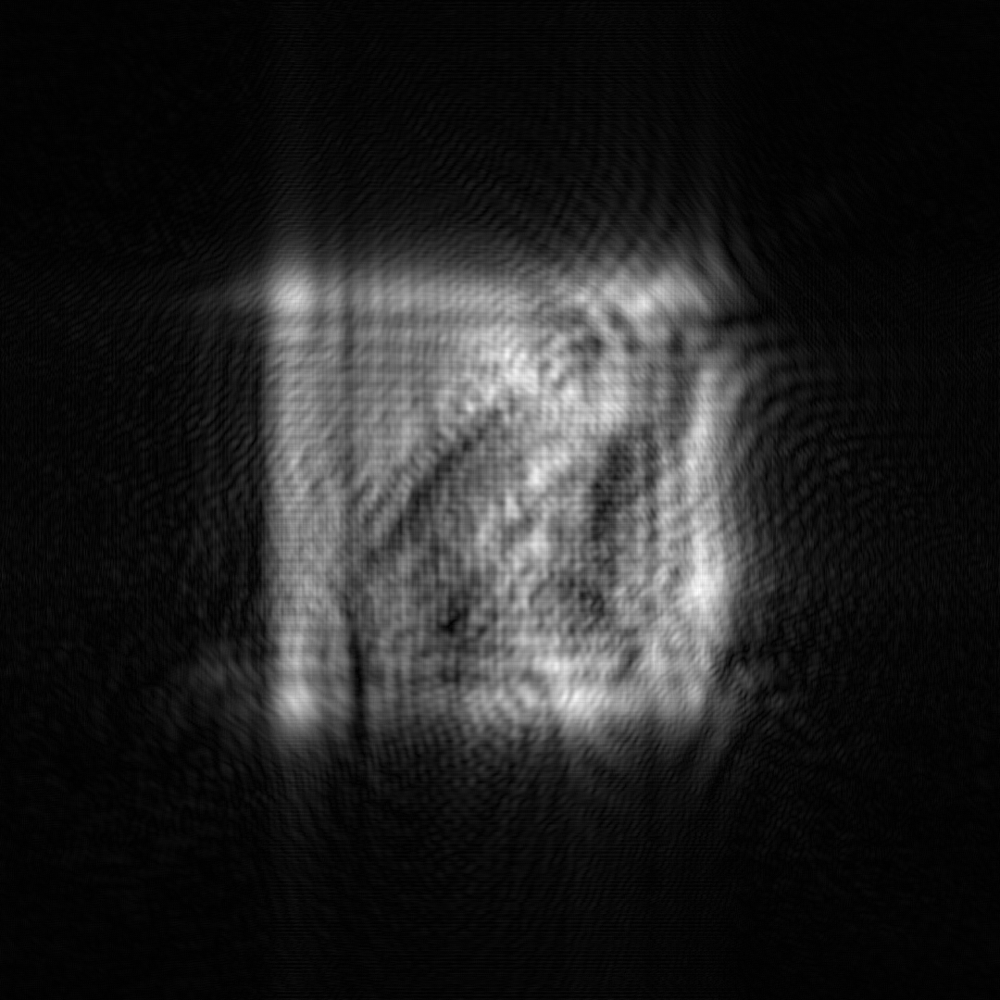
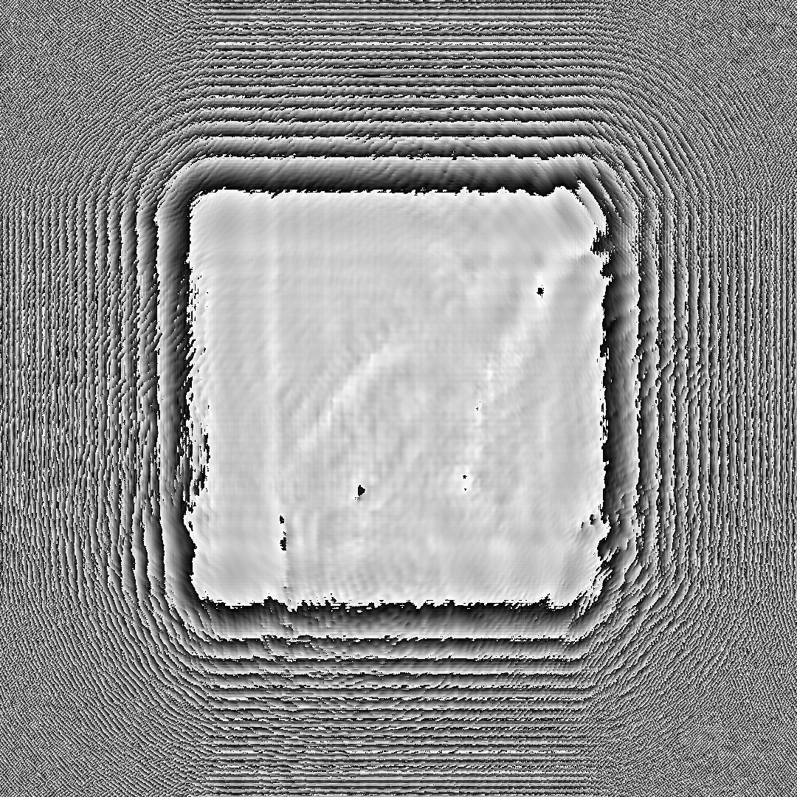
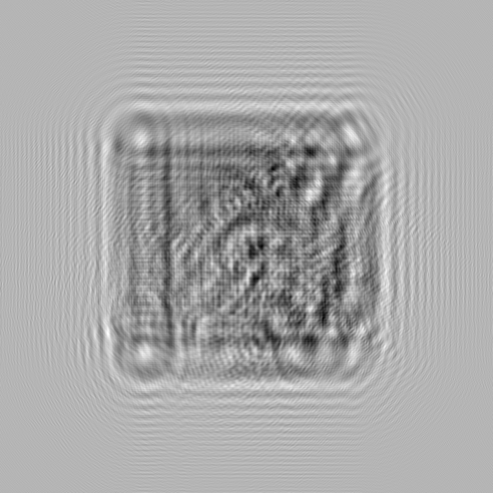
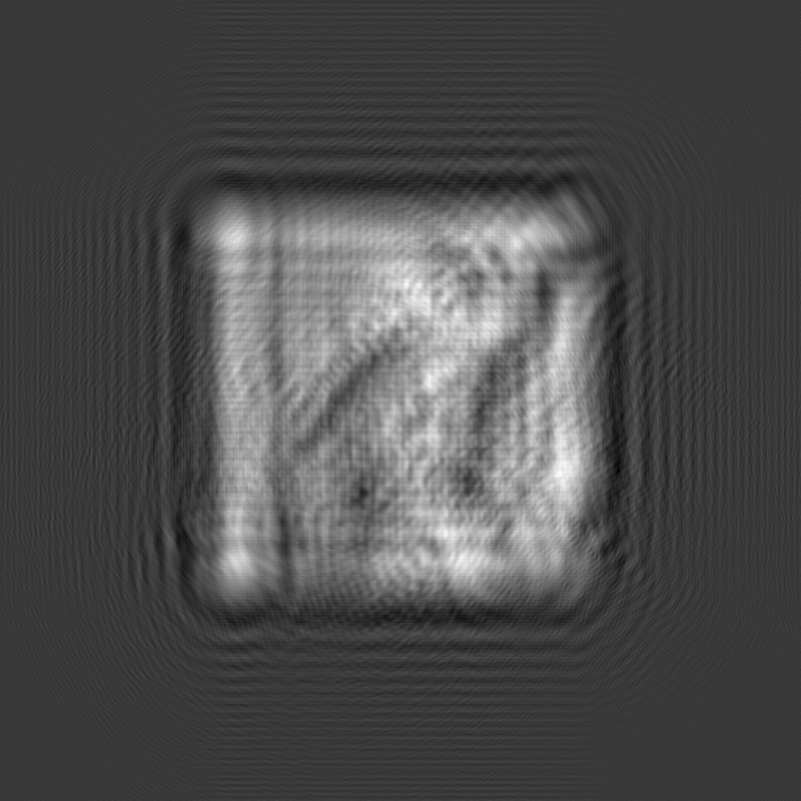

# angular_spectrum 2 hologram

This is a python demo for  angular_spectrum 2 hologram

## usage

1. put a image in the same directory

2. set image_name = 'xxx.bmp' in 'hologram.py'

3. then run:

>pyhon holigram.py

### we offered:

- holointensity_map

- holophase_map

- holoreal_real_map

- holoimag_map

- reconstruction_map

This code is emplemented version from matlab_type 